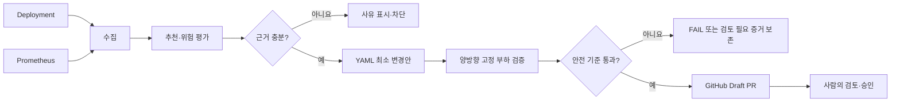

# KubeFit

**한국어** | [English](README.en.md)

KubeFit은 Kubernetes `Deployment`의 CPU·메모리 사용량을 분석해 리소스
`requests/limits`를 추천하고, 변경 근거와 검증 결과를 GitHub Draft PR로 전달하는
GitOps 기반 오픈소스 도구입니다. 운영 환경을 자동으로 축소하거나 배포하지 않습니다.

> 먼저 측정하고, 위험을 검증한 뒤, 사람이 변경을 승인합니다.


위 화면은 저장된 두 benchmark artifact를 서버에서 재검증한 과거 `PASS` Pair입니다.
수정 가능한 예제 입력이나 현재 Prometheus 화면이 그 판정의 근거는 아닙니다.

## 해결하는 문제

과도한 request는 할당 가능한 클러스터 용량을 낭비하고, 지나치게 낮은 limit는
CPU throttling·OOMKilled·응답 지연을 일으킬 수 있습니다. 추천 수치만 제시하면
그 값이 나온 이유와 실제 변경 위험을 검토하기 어렵습니다.

KubeFit은 Kubernetes와 Prometheus에서 워크로드 식별자·사용량·상태를 읽고,
CPU P95와 메모리 P99에 안전 여유를 적용합니다. 관측 범위나 위험 신호가 부족하면
변경 제안을 차단합니다. 비용은 **request 기반 예측치**로 표시하며, 실제 클라우드
청구액 절감으로 표현하지 않습니다.



추가로 image·replica·resource 변경을 대상으로 한 범용 검증과, **일회용 kind
클러스터에서만** 가능한 선택적 PodKill 복구 실험을 제공합니다. 리소스 변경 검증에는
현재 Pod UID에 연결된 Prometheus CPU throttling 근거가 필요합니다. 성능 지표가
통과해도 throttling 근거가 없거나 기준을 넘으면 안전 `PASS`가 아닌
`review_required`로 남습니다. HPA 추천, 장애 예측, 운영 환경 자동 변경은 현재
범위에 없습니다.

## 현재 검증 상태와 한계

- 공개 릴리스는 [v0.3.2](https://github.com/sangmu1126/kubefit/releases/tag/v0.3.2)입니다.
  `main`에는 릴리스 이후의 범용 변경·장애 검증 코드도 포함돼 있습니다.
- 로컬 통제 실험에서 이전 성능 정책의 반대 순서 Pair 하나가 통과해
  [Draft PR #23](https://github.com/sangmu1126/kubefit/pull/23)으로 제안됐습니다.
  PR은 병합·배포되지 않았습니다. 예제 단가로 계산한 월 request 비용은
  `73.000000 → 1.396125 USD`였지만, 이는 **실제 AWS 비용 절감이 아닙니다**.
  이 과거 `PASS`는 새 CPU throttling 게이트의 통과 근거로 소급되지 않습니다.
- 일회용 EKS 파일럿은 고정 부하 100,503건·HTTP 오류 0건의 관측과 KubeFit의
  읽기 전용 추천값 생성을 확인했습니다. 테스트 후 EKS와 Terraform 관리 리소스를 모두
  제거했습니다. [실험 기록](docs/devlog/0108-third-eks-pilot-complete.md)
- 이후 로컬 kind의 추천값 전후 비교에서 기존 성능 전용 `PASS`와 별개로 후보의
  CPU throttling을 발견했습니다. 이를 차단하도록 추가한 게이트는 실제 재실행에서
  공격적인 후보를 `FAIL`로 기록했습니다. 최신 코드 검증은 Python 테스트 619개와
  Ruff 통과입니다. [검증 기록](docs/devlog/0110-resource-change-throttling-gate.md)
- 위 결과는 합성 워크로드의 단기 실험입니다. 실제 사용자 트래픽의 안전성,
  장기 운영 효과, 통계적 유의성, AWS 청구액 절감, 실제 PodKill 복구 성공을
  증명하지 않습니다.

## 빠른 데모

Docker가 실행 중이라면 공개 증거 패키지를 내려받아 SHA-256을 검증하고,
서버가 Pair를 재생한 결과를 브라우저에서 볼 수 있습니다.

```bash
./deploy/local/run-verified-pair-demo.sh
```

출력된 로컬 주소를 열어 Decision Journey를 진행하세요. 이 데모는 Kubernetes나
AWS에 연결하지 않으며 `Ctrl+C` 시 임시 컨테이너를 제거합니다. 공개 릴리스 대신
현재 checkout을 빌드하려면 다음과 같이 실행합니다.

```bash
KUBEFIT_DEMO_BUILD_LOCAL=true ./deploy/local/run-verified-pair-demo.sh
```

## 개발 환경

Python 3.12+, Docker, 대시보드 개발용 Node.js가 필요합니다. 로컬 Kubernetes
실험에는 `kubectl`, `kind`, `helm`, `k6`도 필요합니다.

```bash
python -m venv .venv
. .venv/bin/activate
python -m pip install --require-hashes -r requirements/build.lock
python -m pip install --require-hashes -r requirements/dev.lock
python -m pip install --no-deps --no-build-isolation -e .
python -m pip check
pytest -q
uvicorn api.main:app --reload
```

대시보드는 `http://127.0.0.1:8000`, API 문서는 `/docs`에서 볼 수 있습니다.
kind·Prometheus·데모 Deployment를 실행하려면 `./deploy/local/up.sh`, 종료하려면
`./deploy/local/down.sh`를 사용하세요. 로컬 스크립트는 AWS 리소스를 만들지
않습니다. 수집·추천·YAML 패치·Draft PR·부하 검증의 전체 명령은
[로컬 개발 가이드](docs/local-development.md)에 있습니다.

## 안전 경계

- 추천 경로는 운영 워크로드를 직접 변경하지 않습니다. 게시 기능은 Draft PR만
  만들며 병합·배포하지 않습니다.
- 부하·장애 실험은 명시적으로 확인한 일회용 `kind-*` 환경으로 제한됩니다.
  변경 검증은 종료 시 원본 복원을 시도하고 실패 증거를 보존합니다.
- 분석 대상과 YAML 파일의 동일성, Pod UID, 근거 범위, artifact 해시를 검증합니다.
  모호하거나 오래된 입력은 성공으로 처리하지 않습니다.
- CPU throttling, OOM, latency, 비용은 서로 다른 근거입니다. 비용 예상치만으로
  안전 판정을 뒤집지 않습니다.

구현과 한계는 [아키텍처](docs/architecture.md), [개발 기록](docs/devlog/README.md),
[보안 정책](SECURITY.md), [EKS 파일럿 문서](docs/eks-pilot.md)에 기록했습니다.
KubeFit은 기존 서버리스 프로젝트의 문제 경험에서 출발했지만 별도 저장소에서
독립적으로 구현한 오픈소스 도구입니다.

기여 방법은 [CONTRIBUTING.md](CONTRIBUTING.md), 행동 기준은
[CODE_OF_CONDUCT.md](CODE_OF_CONDUCT.md)를 확인하세요. 라이선스는
[Apache 2.0](LICENSE)입니다.
