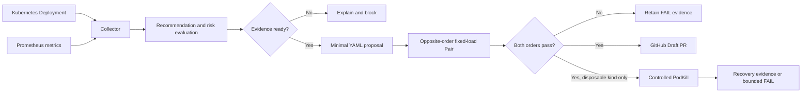

# KubeFit

**English** | [한국어](README.ko.md)

KubeFit is an open-source, GitOps-first Kubernetes resource optimization platform.
It analyzes Deployment usage, explains CPU and memory recommendations, validates a
candidate under fixed load, and proposes the reviewed YAML change through a GitHub
Draft Pull Request.

> Measure first. Explain the trade-off. Change through GitOps.


The screenshot shows a stored PASS Pair replayed from two opposite-order benchmark
artifacts. Editable demo inputs are visually separated from verified evidence.

## Why KubeFit

Kubernetes resource settings are easy to guess and expensive to get wrong:

- oversized requests waste schedulable capacity and projected cost;
- undersized limits can cause throttling, OOM kills, and latency regressions;
- a recommendation without its metrics and policy is hard to review;
- direct production mutation makes automated optimization difficult to trust.

KubeFit does not silently resize a live workload. It creates evidence, rejects unsafe
or incomplete inputs, and keeps a human reviewer in the deployment path.

## What it does

- Collects Deployment identity, resources, and Pod state from Kubernetes
- Reads CPU, memory, and throttling signals from Prometheus/cAdvisor
- Recommends CPU from P95 and memory from P99 with explicit safety margins
- Reports projected request cost separately from runtime safety
- Generates a minimal, stale-safe Kubernetes YAML patch
- Runs fixed-load before/after validation in both chronological orders
- Publishes immutable, content-addressed evidence bundles
- Creates or reuses an exact Git branch and GitHub Draft Pull Request
- Gates controlled Pod deletion behind a matching PASS performance Pair
- Preregisters and evaluates repeated PodKill recovery campaigns

HPA recommendations, production auto-remediation, multi-cloud pricing, predictive
incident detection, Terraform generation, and an AI chatbot are outside the current
scope.

## Decision flow



Cost never overrides a safety failure. PodKill is an optional post-performance check,
not part of recommendation generation or production automation.

## Evidence and current status

The latest public package is
[`v0.3.2`](https://github.com/sangmu1126/kubefit/releases/tag/v0.3.2). `main` also
contains unreleased generic change and controlled-fault safety work.

| Claim | Evidence |
|---|---|
| Current source contracts are verified | 527 Python tests, Ruff, and diff checks |
| Dashboard is a real packaged frontend | React tests, Vite production build, and non-root image smoke test |
| Helm defaults are least privilege | Tokenless ServiceAccount, read-only filesystem, dropped capabilities, scoped optional RBAC |
| Controlled observation works locally | 100,501 requests, zero errors, complete usage/throttling coverage in [record 0060](docs/devlog/0060-validation-informed-cpu-floor.md) |
| One resource proposal passed both orders | Fully replayed Pair and [Draft PR 23](https://github.com/sangmu1126/kubefit/pull/23) |
| Public packages are anonymously retrievable | Multi-architecture image and OCI Helm chart verification for v0.3.2 |
| The generic gate rejects unstable evidence | A live local Pair failed and blocked PodKill in [record 0093](docs/devlog/0093-live-generic-gate-rejection.md) |

The earlier passing resource proposal projected request cost from `73.000000` to
`1.396125` USD per month using checked-in example rates. This is a mathematical request
cost comparison, not a measured cloud-bill saving. Its Draft PR remains unmerged.

The latest generic live run reduced requests from CPU `1000m` to `500m` and memory
`2Gi` to `1Gi`. Both orders completed with zero HTTP errors and restored the base, but
different low-latency percentile checks failed. KubeFit retained the FAIL Pair and
refused PodKill before deletion. Thresholds were not relaxed and trials were not rerun
to search for a pass.

## Quick demo

With Docker running, replay the public, digest-pinned evidence package:

```bash
./deploy/local/run-verified-pair-demo.sh
```

Open the printed loopback URL and follow the Decision Journey. This path downloads the
published evidence without repository credentials, verifies its SHA-256, mounts it
read-only, and replays the Pair on the server before displaying PASS. It never connects
to Kubernetes and removes the temporary container on `Ctrl+C`.

To build the current checkout instead of using the release image:

```bash
KUBEFIT_DEMO_BUILD_LOCAL=true ./deploy/local/run-verified-pair-demo.sh
```

The default dashboard is an editable scenario. It is not verified benchmark evidence
unless a stored artifact is explicitly loaded and replayed.

## Install for development

Requirements: Python 3.12+, Docker, and Node.js for dashboard development. Local
Kubernetes workflows additionally require `kubectl`, `kind`, `helm`, and `k6`.

```bash
python -m venv .venv
. .venv/bin/activate
python -m pip install --require-hashes -r requirements/build.lock
python -m pip install --require-hashes -r requirements/dev.lock
python -m pip install --no-deps --no-build-isolation -e .
python -m pip check
pytest -q
uvicorn api.main:app --reload
```

Open `http://127.0.0.1:8000` for the dashboard or `/docs` for the API. Maintainers
regenerate reviewed dependency locks with `deploy/local/compile-python-locks.sh`.

## Local Kubernetes workflow

Create the disposable kind cluster, pinned Prometheus stack, and demo:

```bash
./deploy/local/up.sh
```

Prometheus is needed for metric collection. Keep its port-forward running while using
`readiness` or `analyze`:

```bash
kubectl --context kind-kubefit port-forward \
  -n monitoring \
  service/monitoring-kube-prometheus-prometheus \
  9090:9090
```

Check whether the observation window is sufficient before generating a proposal:

```bash
kubefit readiness \
  --context kind-kubefit \
  --namespace kubefit-demo \
  --deployment overprovisioned-api \
  --prometheus-url http://127.0.0.1:9090 \
  --identity-store .kubefit/identities.json
```

Production mode expects representative multi-day history. The one-hour demo profile
is only controlled local evidence. Full collection, analysis, proposal, and publication
commands are in the [local development guide](docs/local-development.md).

Remove the local Kubernetes environment when finished:

```bash
./deploy/local/down.sh
```

These scripts use local Docker and do not create AWS resources.

## Generic change safety workflow

KubeFit can validate supported image, replica, and resource changes independently of
the recommendation pipeline.

### 1. Freeze exact input

```bash
kubefit prepare-change \
  --base /tmp/base.yaml \
  --candidate /tmp/candidate.yaml \
  --namespace demo \
  --deployment api
```

Export the deployed base manifest, copy it to the candidate path, and edit only the
supported image, replica, or resource fields before running this command.

The `change-<digest>` directory contains byte-exact manifests and a replayed semantic
diff. Unsupported fields, unrelated objects, symlinks, tampering, and unchanged input
fail closed.

### 2. Use a rollout-safe application path

Do not use `kubectl port-forward service/...` during a rollout: it can remain attached
to a Pod the benchmark replaces. Use the Kubernetes API Service proxy:

```bash
kubectl --context kind-kubefit proxy \
  --port=8001 \
  --address=127.0.0.1 \
  --accept-hosts='^127\.0\.0\.1$'
```

### 3. Measure both orders

```bash
kubefit benchmark-change \
  --change .kubefit/changes/change-<digest> \
  --target-url http://127.0.0.1:8001/api/v1/namespaces/demo/services/http:api:80/proxy/ \
  --context kind-kubefit \
  --container api \
  --confirm-disposable-cluster \
  --execution-order before-after

kubefit benchmark-change \
  --change .kubefit/changes/change-<digest> \
  --target-url http://127.0.0.1:8001/api/v1/namespaces/demo/services/http:api:80/proxy/ \
  --context kind-kubefit \
  --container api \
  --confirm-disposable-cluster \
  --execution-order after-before
```

Each command measures base and candidate with the same warmup, steady, spike, and
recovery profile and always attempts base restoration.

### 4. Bind the Pair

```bash
kubefit benchmark-change-pair \
  --first .kubefit/change-performance/change-performance-<first> \
  --second .kubefit/change-performance/change-performance-<second>
```

Both independent orders and their non-order policy checks must pass. The Pair reduces
directional time bias but does not establish statistical significance.

## Controlled PodKill workflow

PodKill is unavailable until the exact change has a matching PASS Pair. It is restricted
to an explicitly acknowledged `kind-*` context and requires at least two ready replicas.

```bash
kubefit podkill-preflight \
  --context kind-kubefit \
  --namespace demo \
  --deployment api \
  --container api

kubefit podkill-run \
  --change .kubefit/changes/change-<digest> \
  --performance-pair \
    .kubefit/change-performance-pairs/change-performance-pair-<digest> \
  --target-url http://127.0.0.1:8001/api/v1/namespaces/demo/services/http:api:80/proxy/ \
  --context kind-kubefit \
  --container api \
  --confirm-disposable-cluster \
  --confirm-pod-deletion
```

The runner follows Deployment UID to owned ReplicaSet UID to owned Pod UID, refreshes
the preflight before mutation, deletes one exact Pod name, and requires both an HTTP
success streak and a new ready Pod UID. Timeout FAIL is persisted before exit.

Repeated trials must be preregistered before collection:

```bash
kubefit podkill-campaign-plan \
  --change .kubefit/changes/change-<digest> \
  --performance-pair \
    .kubefit/change-performance-pairs/change-performance-pair-<digest> \
  --context kind-kubefit \
  --planned-trials 3 \
  --allowed-failed-trials 0 \
  --service-recovery-limit-seconds 3 \
  --replacement-ready-limit-seconds 30

kubefit podkill-campaign-check \
  --plan .kubefit/podkill-campaigns/podkill-campaign-<digest> \
  --trial .kubefit/podkill-results/podkill-<first> \
  --trial .kubefit/podkill-results/podkill-<second> \
  --trial .kubefit/podkill-results/podkill-<third>
```

Campaigns reject missing, duplicate, mixed-context, mixed-target, and overlapping
trials. P50/P95 values describe successful recoveries; they are not confidence
intervals.

## Safety model

- Production workloads are never resized or fault-injected automatically.
- Mutation commands require explicit confirmation and an explicit `kind-*` context.
- Recommendations remain blocked when coverage or critical risk is unknown.
- Evidence is content addressed and recursively replayed on load.
- Exact files, sizes, hashes, workload identities, and policies are verified.
- Base restoration is mandatory after benchmark mutation, including failures.
- FAIL evidence is preserved; incomplete or structurally invalid evidence cannot pass.
- Git publication creates Draft PRs only. KubeFit never merges or deploys them.
- Example pricing is source-labeled and separated from runtime measurements.

See the [security policy](SECURITY.md) and [architecture](docs/architecture.md) for
the detailed boundaries and image/Helm security model.

## Repository layout

```text
collector/       Kubernetes and Prometheus collection
recommender/     Resource recommendation policy
evaluator/       Cost, readiness, and risk evaluation
gitops/          YAML patch and GitHub Draft PR integration
benchmarks/      Fixed-load execution and evidence
safety/          Generic change and controlled-fault gates
api/             FastAPI application and CLI
dashboard/       React review interface
deploy/          Helm chart, demo manifests, and local scripts
docs/            Architecture, security, runbooks, and development journal
tests/           Unit and integration contracts
```

Useful references:

- [Local development and full command reference](docs/local-development.md)
- [Architecture](docs/architecture.md)
- [Implementation history](docs/devlog/README.md)
- [Helm chart guide](deploy/helm/kubefit/README.md)
- [Contribution guide](CONTRIBUTING.md)
- [Release readiness](docs/release-readiness.md)

## Known limitations

- Aggregated Prometheus percentiles are retained, not the complete raw time series.
- Request-cost projections omit node packing, discounts, taxes, and actual autoscaling.
- Relative latency limits can be sensitive when a baseline is only a few milliseconds;
  policies must be fixed before evidence collection.
- A counterbalanced Pair reduces order bias but does not estimate variance.
- Small local PodKill campaigns do not prove production reliability.
- No live PodKill recovery result exists: the latest generic Pair correctly failed its
  prerequisite gate.

## Project origin

KubeFit grew from lessons about over-allocation and observability learned while operating
an earlier serverless platform. It is independently designed and implemented as an
open-source Kubernetes optimization tool; the earlier project is context, not this
repository's codebase.

## Contributing and license

Contributions are welcome. Read [CONTRIBUTING.md](CONTRIBUTING.md) and the
[Code of Conduct](CODE_OF_CONDUCT.md) before opening an issue or pull request.

KubeFit is distributed under the [Apache License 2.0](LICENSE).
