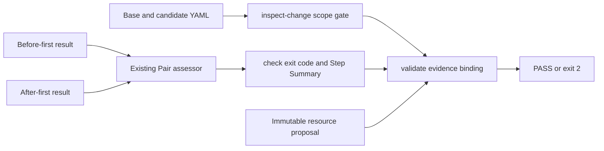

# 0078: Turning Benchmark Evidence into a PR Safety Check

- **Date:** 2026-09-09
- **Status:** validated
- **Related phase:** Post-contest change-safety evolution
- **Commits:** intentionally uncommitted during the review freeze

## Why

KubeFit could already produce and replay trustworthy resource-optimization evidence,
but CI could not present that decision as a native step summary. It also lacked an
explicit boundary between Deployment changes it understands and unrelated changes.
Calling the existing CLI from CI was possible, but the reviewer had to interpret raw
JSON and arbitrary manifest changes could be mistaken for validated inputs.

## Success criteria

- PASS, FAIL, and INVALID Pair outcomes become machine-enforceable exit statuses.
- GitHub Actions receives a readable summary without duplicating policy evaluation.
- Base/candidate YAML formatting does not appear as a Deployment change.
- Image, replica, and CPU/memory resource paths are classified explicitly.
- Unsupported values such as environment data do not leak into CI output.

## What changed

`kubefit check` now reuses the counterbalanced Pair assessor, emits its structured
decision, appends a GitHub Step Summary when requested, and returns exit code 2 unless
the result passes. `kubefit inspect-change` semantically compares one named apps/v1
Deployment and rejects empty or out-of-scope changes. `kubefit validate` then binds an
existing resource proposal's exact base/candidate payloads to both Pair trials and one
final CI verdict.

## How



The standalone paths remain useful for diagnostics. The integrated gate is stricter:
both manifests must match the verified proposal byte-for-byte and both benchmark trials
must name that proposal before performance PASS can unlock the gate.

### Alternatives and trade-offs

| Option | Benefit | Cost or risk | Decision |
|---|---|---|---|
| Reimplement policy rules for CI | Custom output | Two verdict implementations can disagree | Rejected |
| Treat every YAML diff as supported | Broad first release | Claims safety for unmeasured behavior | Rejected |
| Reuse Pair assessment and bind exact proposal bytes | Small, auditable increment | Generic image/replica bundles remain | Selected |

## Problems encountered

The first change model retained before/after values for unsupported fields. That could
echo literal environment values into a public CI log. Unsupported entries were changed
to path-only locations before validation; supported image, replica, and resource values
remain visible because they are the declared review surface.

The first live Step Summary attempt also rejected `/tmp` on macOS because that path is
a normal link to `/private/tmp`. The implementation now rejects a symlinked output file
but accepts a parent that resolves to a directory, covered by a regression test.

Finally, the first semantic loader inherited PyYAML's duplicate-key overwrite and alias
support. Because a pull request is untrusted input, the inspection boundary now rejects
duplicate keys, anchors/aliases, and files above 1 MB instead of interpreting ambiguous
or expansion-heavy YAML.

## Evidence

### Reproduction

```bash
.venv/bin/ruff check .
PYTHONDONTWRITEBYTECODE=1 .venv/bin/pytest -p no:cacheprovider
```

### Results

| Signal | Result | Interpretation |
|---|---:|---|
| Python tests | 425 passed | Existing and new contracts remain green |
| Ruff | passed | No selected lint violations |
| New focused contracts | 22 | Scope, binding, summaries, exit codes, and untrusted YAML handling |
| Retained real Pair | PASS | Exact proposal and four resource changes passed `validate` |

## Decision and limitations

KubeFit now provides end-to-end CI validation for its resource proposal artifacts:
exact manifests, proposal identity, two opposite-order trials, and the policy verdict
are one fail-closed decision. The broader inspector recognizes image and replica paths,
but KubeFit cannot yet execute and bind arbitrary image/replica PR changes. No cluster
fault was injected in this slice.

## Next question

Can a generic change bundle extend the same byte binding and restoration guarantees to
image/replica changes before introducing one controlled PodKill fault?
