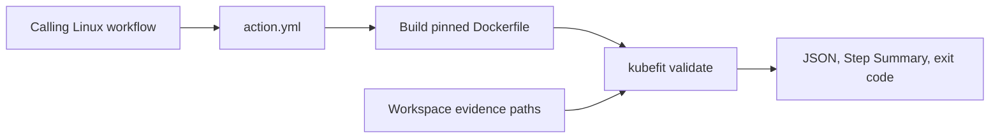

# 0079: Exposing the Safety Gate as a Reusable GitHub Action

- **Date:** 2026-09-09
- **Status:** locally validated
- **Related phase:** Post-contest change-safety evolution
- **Commits:** intentionally uncommitted during the review freeze

## Why

Entry 0078 produced an enforceable CLI, but consumers still had to install KubeFit and
translate its arguments into workflow steps. A PR Check product needs a repository-level
Action contract while preserving the same validation implementation.

## Success criteria

- Five required evidence paths map directly to `kubefit validate`.
- PR-controlled input values are never evaluated by a command shell.
- Both production and Action images contain the newly added safety package.
- The dedicated Action image can read Linux runner-owned evidence and execute PASS.
- Local validation is not presented as a hosted GitHub Actions run.

## What changed

The root `action.yml` defines a Docker container action using `Dockerfile.action`. This
minimal image omits the dashboard and starts `kubefit` directly. The API Docker builder
also now copies the `safety` package before creating the wheel. Three contract tests
protect the Action inputs, direct argument mapping, and both package-copy boundaries.

## How



The Action metadata passes every `${{ inputs.* }}` value as an item in `runs.args`.
There is no `sh -c`, interpolation script, token input, or cluster credential input.

### Alternatives and trade-offs

| Option | Benefit | Cost or risk | Decision |
|---|---|---|---|
| Composite action with pip install | Fast image-free start | Mutates caller Python environment | Rejected |
| JavaScript action | Fast startup | Duplicates Python validation logic | Rejected |
| Production Dockerfile with CLI override | One image | UID 10001 may not read runner-owned `0700` evidence | Rejected |
| Dedicated CLI Dockerfile | Reliable mounted-file access and no dashboard | Separate image recipe | Selected |

## Problems encountered

The first action review exposed that `pyproject.toml` included `safety`, while the API
Docker builder did not copy that directory. Unit tests passed from the checkout, but an
image build would fail. The Dockerfile was corrected before the Action was documented.

The first local runtime used the production image's non-root UID. Docker Desktop file
sharing succeeded, but a Linux runner can retain proposal directories as owner-only
`0700`. The Action was moved to a minimal dedicated image whose process can read the
mounted calling workspace. The validation code itself writes only the Step Summary;
the supplied evidence paths remain read-only inputs.

An attempted lint command also passed Dockerfile and YAML paths to Ruff, producing parser
errors unrelated to those files. The scoped Python lint passed; metadata is instead
loaded and asserted as YAML in its contract tests.

## Evidence

```bash
docker build --file Dockerfile.action --tag kubefit-action:local .
docker run --rm ... kubefit-action:local validate ...
```

| Signal | Result | Interpretation |
|---|---:|---|
| Action contract tests | 3 passed | Required inputs and exec arguments are fixed |
| Docker wheel build | passed | `safety` exists in the packaged image |
| Action container validation | PASS | Retained proposal, manifests, Pair, and summary work together |
| Running containers after test | 0 persistent | `--rm` removed the test container |

## Decision and limitations

The source now contains a reusable Docker Action contract and a locally exercised
runtime. It cannot be consumed by tag until these uncommitted changes are deliberately
released. GitHub-hosted execution, marketplace listing, and macOS/Windows Docker action
support are not claimed.

## Next question

After the commit freeze is lifted, should the first hosted validation use a prerelease
tag before moving a stable major Action tag?
