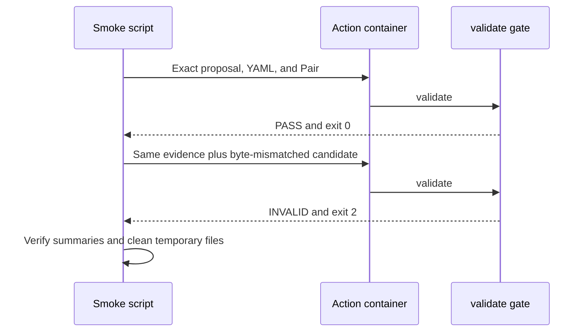

# 0080: Proving the Action Fails Closed on Unbound Candidates

- **Date:** 2026-09-09
- **Status:** locally validated
- **Related phase:** Post-contest change-safety evolution
- **Commits:** intentionally uncommitted during the review freeze

## Why

A successful container run proves only the happy path. The Action must also reject a
candidate that is semantically equivalent but not byte-identical to the measured
proposal output, return the documented CI exit code, and leave an intelligible Summary.

## Success criteria

- The same Action image passes the retained exact evidence.
- Appending one newline to the candidate makes the end-to-end gate INVALID.
- INVALID returns exit code 2 rather than an ambiguous process failure.
- Both paths write their expected Step Summary headings.
- Every container is removed after execution and temporary evidence is cleaned.

## What changed

`deploy/local/verify-safety-action.sh` now provides one repeatable Action smoke test. It
mounts repository evidence read-only, runs the exact candidate, creates a temporary
newline-modified candidate, and verifies PASS followed by INVALID/2. It requires safe
repository-relative, existing, non-symlinked inputs.

## How



### Alternatives and trade-offs

| Option | Benefit | Cost or risk | Decision |
|---|---|---|---|
| Unit tests only | Fast | Does not test packaged CLI, mounts, or exit propagation | Rejected |
| Manual two-command check | No script | Hard to repeat consistently | Rejected |
| One disposable smoke script | Repeatable positive and negative proof | Requires local Docker and retained evidence | Selected |

## Problems encountered

The first source-contract assertion accidentally included an `apply_patch` marker in
its expected string. Bash syntax and the script were valid; the assertion was corrected
to count the two array-based `docker run` invocations before live execution.

## Evidence

```bash
deploy/local/verify-safety-action.sh \
  kubefit-action:local \
  .kubefit/proposals/proposal-<digest> \
  .kubefit/proposals/proposal-<digest>/manifests/before/<path> \
  .kubefit/proposals/proposal-<digest>/manifests/after/<path> \
  benchmarks/pairs/benchmark-pair-<digest>/trials/benchmark-<first> \
  benchmarks/pairs/benchmark-pair-<digest>/trials/benchmark-<second>
```

| Signal | Result | Interpretation |
|---|---:|---|
| Exact candidate | PASS / 0 | Fully bound evidence unlocks the gate |
| Newline-modified candidate | INVALID / 2 | Semantic similarity cannot bypass byte binding |
| Script contract tests | 2 passed | Syntax and both verdict checks remain explicit |

## Decision and limitations

The local Action runtime now has both positive and fail-closed packaged evidence. This
still does not replace a hosted GitHub run after tagging, and it does not execute a new
benchmark or inject a Kubernetes fault.

## Next question

Is a hosted prerelease Action check sufficient to close this resource-only enhancement,
or should generic image/replica evidence become a separate versioned project phase?
