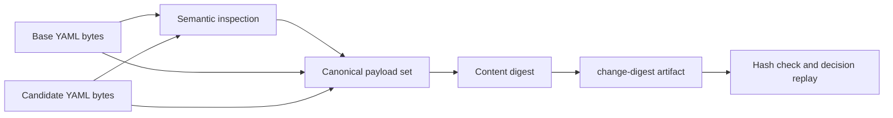

# 0081: Freezing Generic Deployment Changes Before Execution

- **Date:** 2026-09-09
- **Status:** validated
- **Related phase:** Generic change-safety foundation
- **Commits:** intentionally uncommitted during the review freeze

## Why

The resource proposal already binds recommendation evidence to exact manifests, while
the broader change inspector recognizes image and replica paths without assigning them
a stable identity. Benchmark or fault evidence cannot safely refer to a mutable pair of
filesystem paths. The input must become immutable before execution is expanded.

## Success criteria

- Exact base/candidate bytes and the semantic decision share one artifact ID.
- The artifact is atomic, content-addressed, deterministic, and retry-safe.
- Loading verifies every file and replays the Deployment change decision.
- Empty, unsupported, symlinked, partial, or tampered inputs fail closed.
- The artifact does not claim benchmark or fault evidence.

## What changed

`kubefit prepare-change` publishes `change-<digest>` with canonical `change.json`, exact
base/candidate manifests, and a hashed index. A dedicated loader verifies the complete
bundle and returns paths suitable for a future disposable-cluster runner.

## How



The writer reads each input before inspection and confirms the bytes did not change
after inspection. Publication uses an exclusive root lock, owner-only staging tree,
file fsync, atomic rename, and idempotent replay of an existing digest.

### Alternatives and trade-offs

| Option | Benefit | Cost or risk | Decision |
|---|---|---|---|
| Pass mutable paths directly to a runner | Minimal code | Evidence can change between runs | Rejected |
| Extend resource proposal schema in place | Reuses one artifact | Breaks recommendation/evaluation invariants | Rejected |
| Separate generic change bundle | Preserves old contracts | Runner integration remains next | Selected |

## Problems encountered

The first loader validated the typed `change.json` but did not require its bytes to use
the canonical serializer. The loader now parses the raw JSON, compares canonical bytes,
and only then replays the decision. Inspection errors are wrapped at the bundle boundary
so the CLI exposes one stable failure type.

## Evidence

```bash
kubefit prepare-change --base ... --candidate ... --namespace ... --deployment ...
kubefit prepare-change --base ... --candidate ... --namespace ... --deployment ...
```

| Signal | Result | Interpretation |
|---|---:|---|
| First retained resource input | `change-a08806bd53cd8aa19b156cd842ad9955` | Exact bytes received a stable identity |
| Identical retry | `reused: true` | No duplicate or rewrite occurred |
| Bundle tests | 4 passed | Replay, reuse, tamper, and unchanged paths are covered |
| CLI contract | passed | Machine-readable handoff is stable |

## Decision and limitations

Generic supported Deployment inputs can now be frozen and replayed independently of
the recommendation model. No generic benchmark result references this ID yet, and the
bundle does not contain cost, workload identity, load, PodKill, or restoration evidence.

## Next question

What is the smallest disposable-cluster runner contract that can execute this bundle
without weakening KubeFit's mandatory restoration behavior?
