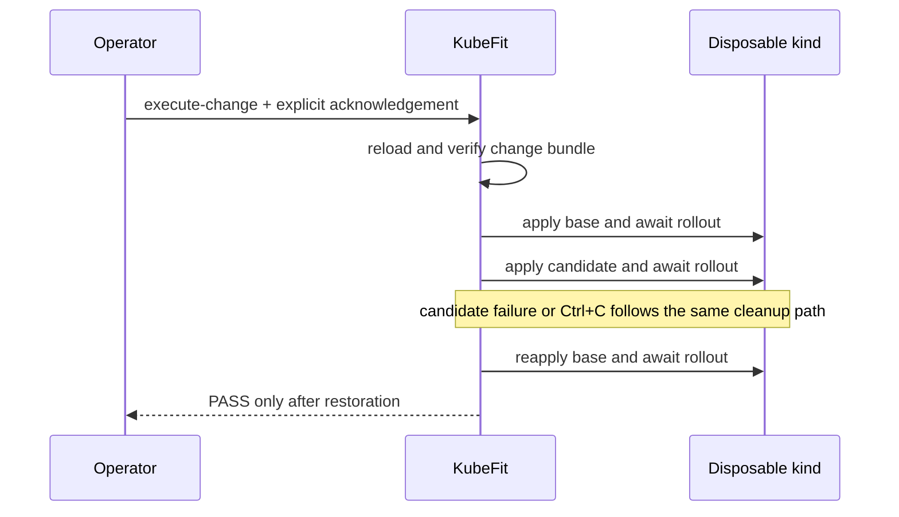

# 0082: Executing Generic Changes with Mandatory Restoration

- **Date:** 2026-09-09
- **Status:** locally validated contract
- **Related phase:** Generic change-safety execution
- **Commits:** intentionally uncommitted during the review freeze

## Why

The immutable change bundle answered which exact Deployment bytes should be tested,
but it did not execute them. Image and replica changes need a minimal deployment check
before load or fault experiments are added. That first runner must not leave the
candidate active after success, failure, or operator interruption.

## Success criteria

- Load and revalidate the immutable bundle before cluster mutation.
- Accept only an explicitly named disposable `kind-*` context at the CLI boundary.
- Establish a ready base, test the candidate rollout, and restore the base.
- Attempt restoration after candidate failure and `Ctrl+C`.
- Report restoration failure distinctly and avoid performance or resilience claims.

## What changed

`kubefit execute-change` composes the existing kubectl manifest controller with a new
generic runner. The returned schema identifies the change and target and reports PASS
only after the candidate became ready and the original base became ready again.

## How

The runner catches `BaseException` around execution so `KeyboardInterrupt` cannot skip
cleanup. It re-raises the interruption after a successful restoration. If restoration
itself fails, that failure is surfaced as the dominant safety error because the cluster
state is no longer known to be safe.

### Alternatives and trade-offs

| Option | Benefit | Cost or risk | Decision |
|---|---|---|---|
| Add load and fault injection immediately | Larger visible feature | Mixes deployability, performance, and resilience evidence | Rejected |
| Reuse the resource benchmark runner unchanged | Less code | Requires proposal identity and measurement contracts unrelated to generic changes | Rejected |
| Minimal readiness runner over immutable bundle | Small honest claim and reusable cleanup boundary | No performance conclusion yet | Selected |

## Evidence

Targeted runner and CLI tests cover success ordering, candidate rollout failure,
restoration failure, forced interruption, CLI composition, and non-kind rejection.
The full repository verification completed with `441 passed`, Ruff clean, and
`git diff --check` clean. No live cluster run is claimed in this entry because the
previously used local cluster had been shut down.

## Decision and limitations

KubeFit can now verify deployability and rollout readiness for supported exact image,
replica, or resource Deployment changes on disposable kind. It cannot yet say that an
image or replica change preserves latency, tolerates Pod loss, or satisfies an SLO.
Those require separately identified load and fault evidence.

## Next question

How should a fixed, reproducible load phase be bound to the generic change ID without
conflating readiness success with performance success?
