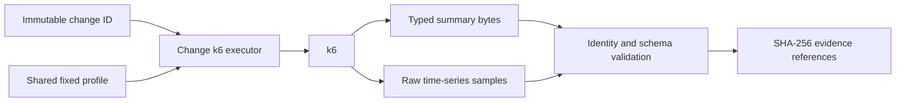

# 0083: Binding Fixed-Load Evidence to a Generic Change

- **Date:** 2026-09-09
- **Status:** locally validated collection contract
- **Related phase:** Generic performance evidence
- **Commits:** intentionally uncommitted during the review freeze

## Why

Readiness only proves that Kubernetes declared a rollout ready. It cannot show whether
an image, replica, or resource change increased latency or errors. The existing fixed
k6 profile produced useful evidence, but its identity contract accepted only resource
recommendation `proposal-*` artifacts. Reusing it without rebinding the output would
make generic evidence refer to the wrong object.

## Success criteria

- Preserve every existing proposal-mode k6 output.
- Require exactly one proposal or generic change identity.
- Parse generic results with a dedicated immutable schema.
- Reject mismatched output identity and unsafe script inputs.
- Preserve exact summary/raw bytes, timestamps, recovery result, and content hashes.
- Do not claim a generic PASS/FAIL verdict before comparison is implemented.

## What changed

The shared `kubefit-load-v1` script accepts either `KUBEFIT_PROPOSAL_ID` or
`KUBEFIT_CHANGE_ID` and emits the corresponding single identity field. A dedicated
`SubprocessChangeK6Executor` invokes this mode and returns `ChangeTimedLoadResult`.

## How

Recovery parsing now depends on the structural `steady` metrics contract instead of a
proposal-specific summary class. This removes the need to fabricate a proposal ID when
the same raw timing algorithm is used for a generic change.

### Alternatives and trade-offs

| Option | Benefit | Cost or risk | Decision |
|---|---|---|---|
| Reinterpret `proposal_id` as any subject | Smallest edit | Existing field would lie about identity type | Rejected |
| Duplicate the full k6 script | Independent schemas | Load behavior can silently drift | Rejected |
| One profile with exclusive typed identities | Same offered load and backward compatibility | Conditional summary field adds a small branch | Selected |

## Problems encountered

The first real `k6 inspect` attempt used process environment variables. k6 does not pass
them into `__ENV` for inspect unless explicitly requested, so the script correctly
reported a missing target URL. The verification was rerun with k6 `-e` arguments for
both proposal and change modes; both profiles initialized successfully.

## Evidence

- Targeted Python regression set: `62 passed`.
- Real installed k6: `k6 inspect` succeeded in both proposal and change modes.
- Generic tests cover command identity, raw/summary hashes, recovery extraction,
  mismatched change rejection, symlinked script rejection, and shared-profile contract.
- Full repository verification: `446 passed`, Ruff clean, and `git diff --check` clean.

## Decision and limitations

KubeFit can now collect fixed-load data that cryptographically refers to a generic
change rather than a resource proposal. The executor is not yet connected to cluster
variant orchestration, no immutable combined result is published, and no generic
performance PASS/FAIL is claimed.

## Next question

How should base and candidate change-load results be compared and restored as one
fail-closed execution without importing resource cost or Prometheus claims?
