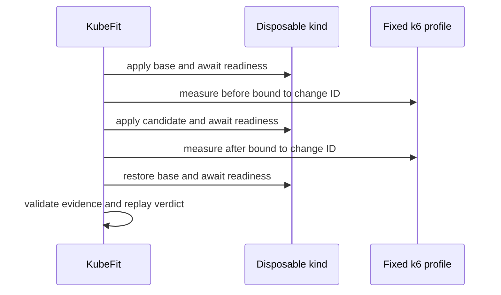

# 0084: Comparing Generic Performance with Mandatory Restoration

- **Date:** 2026-09-09
- **Status:** locally validated internal contract
- **Related phase:** Generic performance execution
- **Commits:** pending

## Why

Change-bound k6 outputs were independently trustworthy, but two outputs did not yet
form one experiment. A comparison must control rollout order, reject incomplete or
overlapping measurements, and restore the original Deployment before returning any
verdict. It must also avoid importing cost and Prometheus claims that generic evidence
does not contain.

## Success criteria

- Apply, stabilize, and measure base before candidate.
- Restore and stabilize base after success, failure, or `Ctrl+C`.
- Classify incomplete identity, profile, time, and offered-load evidence as INVALID.
- Evaluate latency, error rate, and recovery with an explicit saved policy.
- Keep cost, throttling, OOM, and fault injection outside this verdict.

## What changed

`execute_change_performance` coordinates exact manifests from the immutable change
bundle with a change-bound load executor. `ChangePerformanceRun` retains both typed raw
evidence objects, target, policy, verdict, change ID, and confirmed restoration. Model
validation recomputes the verdict using the stored policy.

## How

Execution captures `BaseException` so operator interruption follows the same restoration
path. Only after restoration succeeds does the function construct a result. A custom
policy is embedded in that result, preventing later replay from silently reverting to
default thresholds.

### Decision boundary

| Evidence available | Evaluated now | Explicitly excluded |
|---|---|---|
| Fixed iterations and dropped iterations | Comparability and validity | Statistical confidence |
| P95/P99 and error rate per phase | Candidate regression | Request cost |
| Recovery samples | Recovery completion and time | Kubernetes PodKill recovery |
| k6 bytes and timestamps | Identity and ordering | Prometheus throttling and OOM |

## Problems encountered

The initial result model allowed a custom comparison policy but replayed every verdict
with defaults. That would make a valid custom result impossible to verify later. The
selected policy is now part of the result schema and the validator reuses it exactly.

## Evidence

Targeted tests cover PASS, latency/recovery FAIL, identity/time/load INVALID, custom
policy replay, execution order, `Ctrl+C` restoration, and restoration failure. Full
repository verification completed with `455 passed`, Ruff clean, and
`git diff --check` clean.

## Decision and limitations

The internal runner now gives generic changes an honest performance decision after
restoration. It is not user-facing yet, and its in-memory result is not durable evidence.
No external cluster run is claimed.

## Next question

How can this restored run be published as an atomic content-addressed artifact and
exposed through a fail-closed CLI without serializing raw bytes into terminal output?
