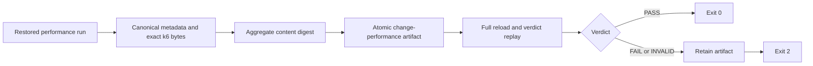

# 0085: Publishing Generic Performance as Immutable Evidence

- **Date:** 2026-09-09
- **Status:** locally validated contract
- **Related phase:** Generic performance publication
- **Commits:** pending

## Why

An in-memory performance verdict disappears when the process ends and raw k6 bytes are
unsafe and impractical to print in terminal JSON. Reviewers need one stable identity
that can be reloaded, hash-checked, and semantically replayed. Failed experiments are
especially important and must not disappear merely because the command exits nonzero.

## Success criteria

- Persist exact k6 summary and raw bytes for both variants.
- Persist target, comparison policy, measurements, verdict, and a readable report.
- Bind every payload to one content-addressed artifact and generic change ID.
- Atomically publish, reload before returning, and idempotently reuse exact evidence.
- Preserve FAIL and INVALID evidence before returning exit code 2.
- Serialize only artifact metadata to stdout.

## What changed

`write_change_performance_artifact` publishes a
`change-performance-<digest>` directory with a hashed index and ten payloads.
`load_change_performance_artifact` verifies the complete file set, sizes, hashes,
aggregate digest, directory identity, canonical metadata JSON, raw-summary bindings,
report, and replayed verdict. `kubefit benchmark-change` connects disposable execution,
per-target locking, publication, and fail-closed exit behavior.

## How

The command acquires the existing lock keyed by context, namespace, and Deployment so a
second benchmark cannot concurrently mutate the same target. Publication uses an
owner-only staging directory, exclusive publication lock, file and directory fsync, and
atomic rename.

### Artifact contents

| Area | Evidence |
|---|---|
| Identity | `result.json`, `target.json` |
| Decision | `policy.json`, `verdict.json`, `report.md` |
| Measurement | canonical before/after records with raw-content hashes |
| Raw proof | exact before/after k6 summary and JSON time-series bytes |

## Problems encountered

The CLI must inspect the change once to derive the target lock key and the runner reloads
it after acquiring the lock. This intentional second validation prevents execution from
trusting only pre-lock metadata. The content-addressed bundle identity makes a silent
valid retarget between those checks fail closed.

## Evidence

Targeted tests cover atomic write/load, idempotent reuse, retained FAIL, metadata/raw/
report tampering, non-canonical index rejection, CLI locking, PASS output, retained FAIL
exit 2, and non-kind rejection. Full repository verification completed with
`464 passed`, Ruff clean, and `git diff --check` clean.

## Decision and limitations

Generic performance evidence is now durable and user-invokable. The new path is unit-
tested but has not been executed against a live kind workload, so no real generic
performance result is claimed. One sequential trial still carries order bias, and the
artifact excludes Prometheus runtime and injected-fault evidence.

## Next question

Should the next evidence layer counterbalance execution order first, or introduce one
controlled PodKill recovery experiment bound to this artifact?
