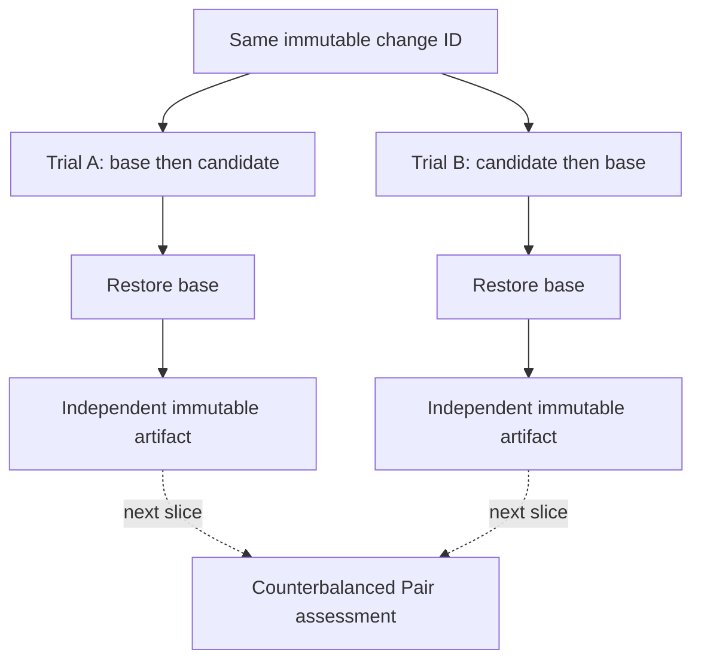

# 0086: Collecting Generic Performance in Opposite Orders

- **Date:** 2026-09-10
- **Status:** locally validated contract
- **Related phase:** Counterbalanced generic performance
- **Commits:** pending

## Why

A base-first run cannot distinguish a true change effect from cache warm-up, background
load, or time drift. The immutable result already exposes that warning, but the generic
runner could produce only the same order repeatedly. A second independent execution
must be able to start with the candidate while still restoring base at the end.

## Success criteria

- Support explicit `before-after` and `after-before` execution.
- Store the declared order in the typed run.
- Derive chronological order from timestamps and reject disagreement.
- Apply the matching exact manifest for each measured variant.
- Restore base after either order.
- Preserve the single-trial warning until Pair assessment exists.

## What changed

`execute_change_performance` now accepts an explicit execution order and maps `before`
to the frozen base manifest and `after` to the frozen candidate manifest. The CLI exposes
the same closed choice. `ChangePerformanceRun` records the order, while artifact loading
derives it independently from the saved non-overlapping timestamps.

## How

The reverse order may apply base twice: once as its second measured variant and once as
mandatory final restoration. This is intentional. A completed base measurement does not
replace the final safety invariant that restoration and readiness occur after all load
collection has ended.

### Alternatives and trade-offs

| Option | Benefit | Cost or risk | Decision |
|---|---|---|---|
| Repeat base-first only | Operationally simple | Cannot reduce order bias | Rejected |
| Skip final restore when base is measured last | Saves one rollout | Load completion is not restoration proof | Rejected |
| Explicit opposite order plus final restore | Auditable and symmetric | Additional rollout time | Selected |

## Evidence

Tests cover reverse apply/measure order, candidate-first warning text, final base
restoration, reverse artifact reload, CLI option propagation, and timestamp/order
agreement. Full repository verification completed with `466 passed`, Ruff clean, and
`git diff --check` clean.

## Decision and limitations

KubeFit can now collect the two independent inputs required for counterbalancing. It
does not yet combine them, so two passing single trials are not currently a Pair PASS.
No new live-cluster result is claimed.

## Next question

How should two opposite-order generic artifacts be bound and assessed without averaging
away a failure in either chronological trial?
