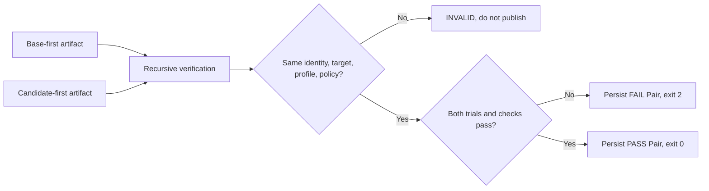

# 0087: Binding Opposite Orders into a Generic Performance Pair

- **Date:** 2026-09-10
- **Status:** locally validated contract
- **Related phase:** Counterbalanced generic performance
- **Commits:** pending

## Why

Two independent opposite-order artifacts reduce order bias only when they are proven to
test the same immutable change under the same target, load profile, and policy. Merely
averaging their latency could hide a candidate that fails in one chronological order.
The two inputs need one deterministic, replayable decision.

## Success criteria

- Accept exactly two distinct, opposite-order performance artifacts.
- Require identical change, target, profile, and comparison policy.
- Require both trial verdicts and all non-order check statuses to pass.
- Never average a failing trial into a PASS.
- Embed both complete trial artifacts in one immutable Pair.
- Persist diagnostic FAIL Pairs but do not publish structurally INVALID inputs.

## What changed

`assess_change_performance_pair` produces a deterministic assessment independent of
argument order. `write_change_performance_pair` embeds both verified trial directories,
the assessment, and a readable report under
`change-performance-pair-<digest>`. The CLI command
`kubefit benchmark-change-pair` publishes PASS or FAIL evidence and exits 2 for any
non-PASS outcome.

## How

The assessment sorts inputs by artifact ID before hashing, so swapping CLI arguments
does not create a different Pair. The Pair loader checks every embedded file, reloads
both child artifacts, and recomputes the assessment and report.

### Why no averaging

| Trial A | Trial B | Pair |
|---|---|---|
| PASS | PASS with identical checks | PASS |
| PASS | FAIL | FAIL |
| PASS | PASS but check statuses disagree | FAIL |
| Any structurally incompatible input | Any | INVALID |

## Evidence

Tests cover deterministic opposite-order PASS, duplicate and same-order INVALID, one-
trial FAIL, self-contained reload, idempotent reuse, persisted FAIL, rejected INVALID,
embedded tamper detection, and CLI exit/persistence behavior. Full repository
verification completed with `477 passed`, Ruff clean, and `git diff --check` clean.

## Decision and limitations

Generic performance now has the same conservative opposite-order decision shape as the
resource benchmark path. Two trials reduce directional order bias but do not estimate
variance or establish significance. No live generic Pair has been collected, and the
Pair still excludes Prometheus runtime and fault-injection evidence.

## Next question

What minimal controlled PodKill experiment can measure service recovery without making
the fault injector itself part of the target workload or obscuring base restoration?
