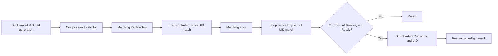

# 0088: Establishing a Read-Only PodKill Ownership Preflight

- **Date:** 2026-09-10
- **Status:** locally validated contract
- **Related phase:** Controlled fault injection
- **Commits:** pending

## Why

A label selector alone does not prove that a Pod belongs to the intended Deployment.
Another workload may share labels, a rollout may be incomplete, or a single-replica
service may lose all capacity. Deletion must remain disabled until KubeFit can identify
one exact, redundant, fully ready Pod through Kubernetes ownership UIDs.

## Success criteria

- Restrict the boundary itself to an explicit `kind-*` context.
- Require at least two desired replicas and full observed rollout availability.
- Follow Deployment UID to controlled ReplicaSet UID to controlled Pod UID.
- Exclude same-label ReplicaSets and Pods owned by another Deployment.
- Require Running and Ready Pod plus ready target container state.
- Select deterministically without issuing a delete.

## What changed

`KubectlPodKillPreflight` reads the Deployment, matching ReplicaSets, and matching Pods,
then emits a typed `PodKillPreflight` containing every eligible candidate and the oldest
selected Pod. `kubefit podkill-preflight` exposes this read-only result.

## How

The Deployment status must report desired, current, updated, ready, and available
replicas all equal after the controller has observed the current generation. The
candidate list length must also equal desired replicas after ownership and readiness
filtering.

### Alternatives and trade-offs

| Option | Benefit | Cost or risk | Decision |
|---|---|---|---|
| Delete the first selector match | Minimal implementation | Can hit another workload | Rejected |
| Reuse only Pod names from metric collection | Less code | Does not prove current readiness or UID chain | Rejected |
| UID ownership traversal plus readiness | Explicit safe target | Three Kubernetes reads | Selected |

## Evidence

Tests cover deterministic oldest-Pod selection, exclusion of same-label foreign
ownership, explicit kubectl context, single-replica rejection before Pod listing,
unready Pod rejection, non-kind rejection, CLI target construction, and the absence of
a delete command. Full repository verification completed with `484 passed`, Ruff clean,
and `git diff --check` clean.

## Decision and limitations

KubeFit can now explain which Pod would be eligible for a controlled fault. It cannot
delete that Pod, probe service continuity, measure replacement readiness, or create
fault evidence yet. No live-cluster fault was performed.

## Next question

How can deletion revalidate the selected Pod immediately beforehand and measure both
HTTP continuity and replacement readiness under one bounded timeout?
