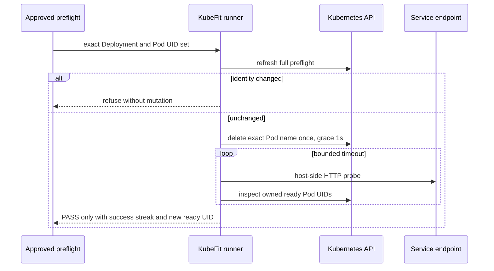

# 0089: Measuring PodKill Recovery Under a Bounded Timeout

- **Date:** 2026-09-10
- **Status:** locally validated internal contract
- **Related phase:** Controlled fault injection
- **Commits:** pending

## Why

The read-only preflight identifies an eligible Pod but can become stale before mutation.
After deletion, Kubernetes replacement readiness alone also cannot prove that clients
continued to receive acceptable HTTP responses. A useful experiment must revalidate
immediately, mutate exactly once, and measure both service and control-plane recovery.

## Success criteria

- Re-run and compare the complete preflight before deletion.
- Refuse mutation if Deployment generation, eligible UID set, or selection changed.
- Delete one exact Deployment Pod name without selector-wide or force deletion.
- Bound the experiment with explicit probe and total timeouts.
- Require a consecutive HTTP success streak and a new fully ready Pod UID.
- Recompute service recovery from retained probe samples.
- Keep the runner internal until failed evidence can be persisted.

## What changed

`PodKillExperimentRunner` consumes an approved preflight, refreshes it, and issues one
`kubectl delete pod <exact-name> --grace-period=1 --wait=false` only when every identity
still matches. It probes from the host while repeating the ownership/readiness
inspection and returns a typed PASS or timeout FAIL result.

## How

HTTP statuses below 500 follow the existing k6 success boundary. Network errors and 5xx
responses reset the consecutive-success streak. Recovery time is the first sample in
the final qualifying streak, not merely the first isolated success.

### Safety decisions

| Decision | Reason |
|---|---|
| Exact Pod name | Never fan out through a selector |
| One-second graceful deletion | Avoid unsafe force deletion semantics |
| Host-side probe | Keep the fault injector outside the target workload |
| New Pod UID required | A ready count alone could refer to the original Pod |
| Timeout returns typed FAIL | Preserve diagnostic outcome instead of hanging |

## Problems encountered

An early loop overwrote `replacement_ready_seconds` on every later poll, which would
report the last observation rather than first readiness. Assignment is now one-shot.
The result validator also originally trusted the supplied recovery number; it now
replays the final consecutive-success streak from ordered samples and rejects mismatch.

## Evidence

Tests cover preflight refresh, exactly one safe delete command, transient HTTP failure,
consecutive-success recovery, replacement UID detection, bounded timeout FAIL, stale
generation refusal before mutation, unsafe URL rejection, non-kind rejection, and
sample/recovery replay. Full verification completed with `490 passed`, Ruff clean, and
`git diff --check` clean.

## Decision and limitations

The internal fault runner has a precise recovery contract, but it is not yet user-facing
or durable. No Pod was deleted in a live cluster during this slice. A failed process
would lose in-memory samples, so external execution remains deliberately unavailable.

## Next question

How should PASS and timeout FAIL fault results be atomically bound to the exact generic
change and passing counterbalanced Pair before enabling the mutation CLI?
