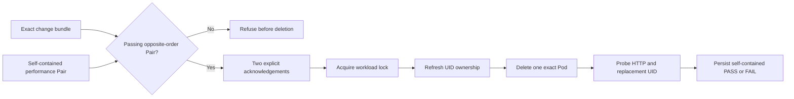

# 0090: Publishing Controlled PodKill Evidence

- **Date:** 2026-09-10
- **Status:** locally validated command and artifact contract
- **Related phase:** Controlled fault injection
- **Commits:** pending

## Why

Deleting a Pod merely because it belongs to a Deployment is not enough. Fault testing
should only follow a known change whose two opposite-order load trials both passed, and
the outcome must remain reviewable even when recovery fails. Otherwise a fault result
can be detached from the candidate that was tested or disappear on timeout.

## Success criteria

- Refuse mutation unless an exact change bundle and its counterbalanced Pair match.
- Require the Pair to be PASS and its target to equal the requested container target.
- Require separate disposable-cluster and Pod-deletion acknowledgements.
- Serialize mutation with the existing workload-scoped benchmark lock.
- Preserve both successful recovery and bounded timeout failure.
- Embed the complete change and Pair trees in content-addressed evidence.
- Reload hashes, typed data, prerequisite relationships, and the report on publication.

## What changed

`kubefit podkill-run` is now the narrow user-facing mutation boundary. It validates the
prerequisites before and inside the workload lock, refreshes ownership immediately
before the exact-name deletion, runs the bounded recovery measurement, and publishes a
`podkill-<digest>` directory. A FAIL artifact is retained before the command exits 2.

The diagram shows the central decision: performance evidence is a prerequisite to fault
injection, not an optional attachment added after deletion.

## How

The artifact index binds the change ID, performance Pair ID, result status, aggregate
digest, and every payload hash and size. It embeds the original change and Pair rather
than storing paths to mutable external directories. Loading recursively revalidates the
embedded artifacts, recomputes the prerequisite relationship, replays the typed
PodKill result, and regenerates the Markdown report.

| Boundary | Behavior |
|---|---|
| Cluster | Only an explicit `kind-*` context |
| Approval | Both disposable-cluster and exact Pod deletion flags |
| Prerequisite | Matching PASS performance Pair |
| Concurrency | One workload-scoped mutation lock |
| Mutation | One exact Pod name; no selector or force deletion |
| Success | HTTP streak and one new ready Pod UID |
| Failure | Persist evidence, print result, exit 2 |

## Problems encountered

The initial artifact loader read `podkill.json` before rejecting a symlink. The check
was moved ahead of the read so the loader never follows an unsafe index path. Publication
also now compares the fully reloaded result to the in-memory result before returning.

## Evidence

Tests cover self-contained publication and reuse, timeout FAIL retention, rejection of
a failed Pair, target mismatch, payload tampering, dual CLI confirmation, non-kind
refusal before artifact reads, lock ordering, and PASS/FAIL exit behavior. Full local
verification completed with `499 passed`, Ruff clean, and `git diff --check` clean.

## Decision and limitations

The mutation CLI is now exposed because failed outcomes can be retained and every run is
bound to preceding change evidence. No live Pod was deleted during this implementation,
so these checks establish the software contract only; they do not establish measured
service recovery or production readiness. The command intentionally remains restricted
to disposable kind clusters.

## Next question

Should a future campaign preregister repeated fault trials and aggregate their recovery
distribution, rather than treating one controlled result as reliability evidence?
