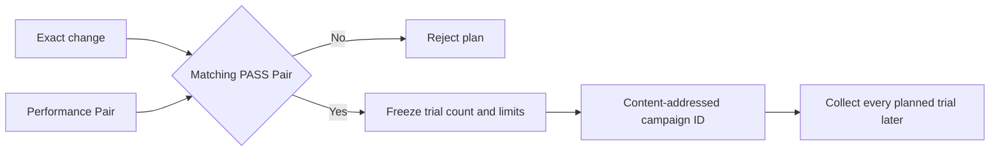

# 0091: Preregistering a Repeated PodKill Campaign

- **Date:** 2026-09-10
- **Status:** locally validated planning contract
- **Related phase:** Repeated controlled fault evaluation
- **Commits:** pending

## Why

One successful PodKill run proves that one observed recovery met its local contract. It
does not establish repeatability. Simply running more trials is also weak evidence if
the operator can stop after a favorable result or choose recovery thresholds afterward.
The experiment count, failure budget, limits, and stopping rule therefore need to exist
before repeated faults begin.

## Success criteria

- Bind the plan to one exact change and its PASS counterbalanced performance Pair.
- Require at least three and at most one hundred trials.
- Freeze allowed failures and both recovery-time limits in the plan identity.
- Require completion of every planned trial regardless of intermediate outcomes.
- Reject a failure budget that could allow every trial to fail.
- Publish canonical, content-addressed JSON plus a replayable report.
- Keep this command read-only; planning must not mutate the cluster.

## What changed

`kubefit podkill-campaign-plan` validates the change/Pair relationship and publishes an
immutable `podkill-campaign-<digest>` plan. Policy changes create a different identity;
an identical retry reuses the existing plan.

The important boundary is temporal: the acceptance policy is frozen before any campaign
outcome can influence it.

## How

The plan identity contains the exact change ID, Pair ID, namespace/Deployment/container
target, planned trial count, allowed failures, HTTP recovery limit, replacement readiness
limit, fixed stopping rule, and explicit limitations. Loading recomputes the digest and
report and rejects extra files, symbolic links, invalid ranges, and non-canonical JSON.

| Field | Constraint | Reason |
|---|---:|---|
| Planned trials | 3–100 | Require replication while bounding execution |
| Allowed failures | 0 to trials − 1 | A campaign cannot pass if every trial may fail |
| HTTP recovery limit | Positive finite seconds | Freeze the client-visible SLO boundary |
| Pod readiness limit | Positive finite seconds | Freeze the control-plane recovery boundary |
| Stopping rule | Complete all planned trials | Prevent favorable early stopping |

## Problems encountered

Threshold values cross both CLI and persisted-model boundaries. The CLI rejects zero,
negative, infinite, and NaN values, while the Pydantic model independently disables
infinite and NaN numbers so library callers cannot bypass the same invariant.

## Evidence

Tests cover deterministic publication and reuse, policy-sensitive identity, lower and
upper trial bounds, impossible failure budgets, failed-Pair rejection before directory
creation, report tampering, and exact CLI argument transfer. Full-suite evidence is
`512 passed`, Ruff clean, and `git diff --check` clean.

## Decision and limitations

This slice preregisters the experiment but does not yet assess collected PodKill
artifacts or compute recovery distributions. No cluster mutation occurs. A small local
campaign remains descriptive evidence for its disposable environment, not proof of
production reliability or statistical significance.

## Next question

How should completed PodKill artifacts be checked for unique trials, chronology, fixed
identity, failure budget, and preregistered recovery limits without hiding any failure?
