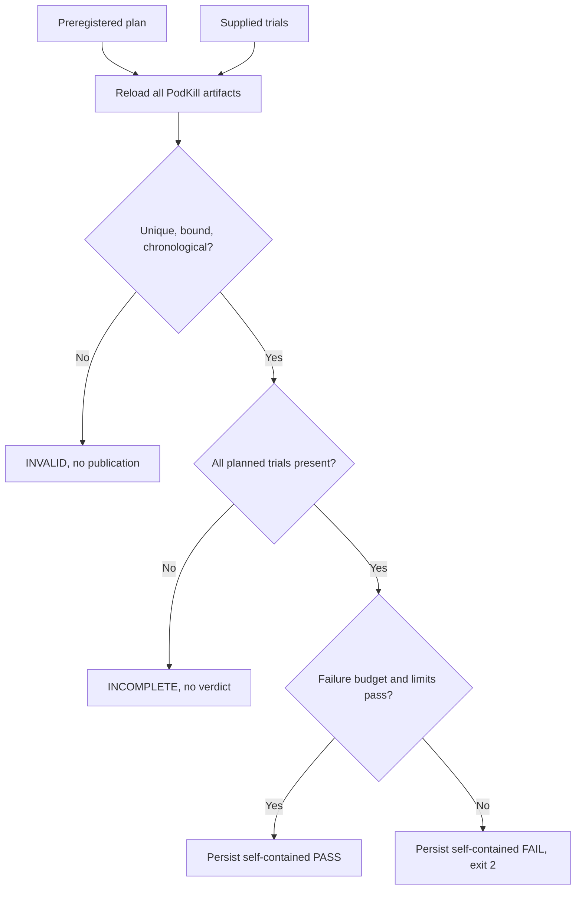

# 0092: Replaying Complete PodKill Campaign Evidence

- **Date:** 2026-09-10
- **Status:** locally validated assessment and artifact contract
- **Related phase:** Repeated controlled fault evaluation
- **Commits:** pending

## Why

A preregistered plan matters only if collected results are checked against it without
selection. Counting the same success twice, mixing clusters, running overlapping faults,
or omitting a failure could otherwise produce a favorable summary that does not describe
the planned experiment. Complete failures must also remain visible rather than vanish
because a command returned a nonzero exit code.

## Success criteria

- Reload and cryptographically verify every supplied PodKill artifact.
- Require the exact planned count before issuing PASS or FAIL.
- Reject duplicate artifact IDs and duplicate deleted Pod UIDs.
- Require one change, performance Pair, kind context, and workload target.
- Reject overlapping experiment intervals.
- Apply the preregistered failure budget and both recovery limits.
- Report deterministic descriptive P50/P95 recovery values.
- Persist complete PASS and FAIL evidence; never persist INCOMPLETE or INVALID input.
- Embed the plan and every full trial so external source paths are unnecessary.

## What changed

`assess_podkill_campaign` produces one typed PASS, FAIL, INCOMPLETE, or INVALID decision.
`kubefit podkill-campaign-check` publishes complete valid decisions as immutable
`podkill-campaign-evidence-<digest>` directories. A complete FAIL is written before the
command exits 2; incomplete or structurally invalid collections are not published.

This ordering prevents policy checks from turning a partial collection into an early
campaign verdict.

## How

Trials are sorted by injection time before evaluation and publication. Adjacent trial
intervals must not overlap. Identity checks compare embedded, replayed change and Pair
IDs plus the preflight context and target. Policy checks count retained timeout failures
and compare successful recovery durations to the frozen limits.

P50 and P95 use a deterministic nearest-rank calculation over successful recovery values.
Failed trials remain counted by the failure-budget check and are not converted into
synthetic timeout values. Consequently, the summaries describe observed successes and
must always be read together with `failed_trials`.

The evidence bundle embeds the campaign plan and each complete PodKill artifact. Its
loader verifies the exact file set, every size and SHA-256 digest, recursively reloads
all nested evidence, recomputes the assessment and evidence ID, and regenerates the
report before accepting it.

| Condition | Campaign state | Published |
|---|---|---|
| Too few planned trials | INCOMPLETE | No |
| Extra, duplicate, mixed, or overlapping trials | INVALID | No |
| Complete and within all limits | PASS | Yes |
| Complete but failure budget or a limit exceeded | FAIL | Yes, then exit 2 |

## Problems encountered

The first overlap test reused the same generated result twice, which triggered the
duplicate check without independently exercising chronology. The second trial now keeps
a distinct Pod identity while sharing the first interval, proving the overlap check on
its own. Campaign plans were also extended to bind the intended kind context; target
identity alone could not prevent results from two disposable clusters being mixed.

## Evidence

Tests cover chronological ordering independent of input order, successful nearest-rank
summaries, incomplete collection, exceeded failure budget, exceeded recovery limit,
duplicate trials, mixed contexts, overlapping intervals, self-contained PASS reuse,
complete FAIL retention, incomplete-publication refusal, embedded tamper rejection, and
all four CLI outcomes. Full verification completed with `527 passed`, Ruff clean, and
`git diff --check` clean.

## Decision and limitations

The campaign now supports replayable repeated evidence without claiming significance.
No live fault was executed in this slice. Context names do not fingerprint the underlying
kind cluster, host load is uncontrolled, and a three-trial campaign remains a small local
sample. Those limitations are retained in the plan and assessment.

## Next question

Should campaign execution itself become a resumable controller with explicit cooldown,
or should KubeFit keep operator-triggered trials separate to preserve human control?
