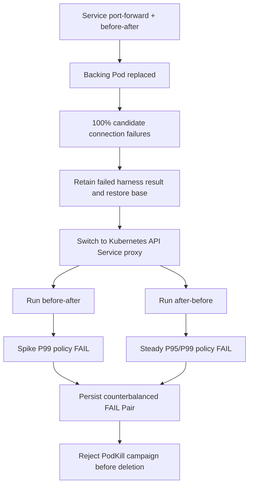

# 0093: Letting the Live Generic Gate Reject a Candidate

- **Date:** 2026-09-10
- **Status:** live local Pair failed; base restored; PodKill blocked
- **Related phase:** Live generic change and fault prerequisite validation
- **Commits:** pending

## Why

The generic change, performance Pair, and PodKill prerequisite contracts had extensive
unit coverage but no live execution. A trustworthy integration run must preserve
collection failures, complete both measurement orders, accept a conservative FAIL, and
prove that fault mutation cannot proceed without a PASS Pair.

## Setup

A fresh single-node `kind-kubefit` cluster was created with the pinned local Prometheus
stack and two-replica nginx demo. The frozen candidate kept replicas and limits unchanged
while reducing CPU requests from `1000m` to `500m` and memory requests from `2Gi` to
`1Gi`. The exact input became:

```text
change-f9b5b71fb5b46db5a5eb32f9bbffa25b
```

No AWS or other cloud resource was created.

## What happened



The first artifact, `change-performance-a785c4b8a5236cd6d623937e72e51969`,
recorded zero candidate latency and 100% errors because `kubectl port-forward service`
was attached to a Pod removed by rollout. This is retained as failed collection history,
not presented as application regression evidence.

The rollout-safe API Service proxy then produced zero errors and complete offered load
in both orders:

| Order | Relevant base to candidate metric | Result |
|---|---:|---|
| before-after | spike P99 `8.817ms to 10.743ms` | +21.837%, FAIL above 15% |
| after-before | steady P95 `9.648ms to 10.799ms` | +11.930%, FAIL above 10% |
| after-before | steady P99 `10.348ms to 11.504ms` | +11.171%, FAIL above 10% |
| both | error rates | 0%, PASS |
| both | recovery | `5s to 5s`, PASS |

The complete artifacts are:

- `change-performance-8621c2ecf0295d014206f75b75c5c49e`
- `change-performance-b85435dc93357cd8579c0b172b1ab505`
- Pair `change-performance-pair-4009629d39bf53a42ddb3cd249c92a04`

The Pair failed because both trials failed and the failing percentile checks differed by
order. This is evidence of an unstable low-latency comparison under the current local
harness, not evidence that request reduction caused a repeatable latency regression.

## Decision

The thresholds were not relaxed after seeing the result and neither order was rerun to
search for a pass. The failed Pair was persisted. `podkill-campaign-plan` rejected it
with `PodKill requires a passing performance Pair`, so no PodKill was executed.

README examples now use the rollout-safe API Service proxy for generic performance and
PodKill commands. The local development guide no longer describes the public PodKill
runner as internal. Prerequisite errors also retain the underlying explanation instead
of collapsing it to a generic invalid message.

## Verification and cleanup

The full suite remained at `527 passed` with Ruff and `git diff --check` clean. Every
benchmark reported `restored: true`, and a direct Kubernetes read confirmed the original
`1000m` CPU and `2Gi` memory requests before teardown. The API proxy was stopped and
`deploy/local/down.sh` deleted `kubefit-control-plane`. No kind cluster, KubeFit Docker
container, or `kubectl` proxy process remained. An unrelated pre-existing Docker Desktop
listener on port 8001 was left untouched. Generated evidence stays only under ignored
`.kubefit/` local storage.

## Limitations and next question

Relative-only latency thresholds are highly sensitive when baseline latency is around
10ms: a roughly 1 to 2ms absolute difference can exceed 10 to 15%. Changing that policy
after this outcome would be post-hoc. A future policy schema may preregister both relative
and absolute tolerances before new evidence is collected. Until then, this candidate
remains blocked and the live run makes no recovery or reliability claim.
