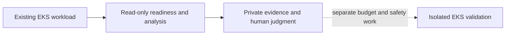

# 0094: EKS read-only pilot boundary

- **Date:** 2026-09-19
- **Status:** locally validated; live EKS observation pending
- **Related phase:** post-MVP EKS compatibility
- **Feature commit:** `10ebe22 feat: retain observation source and guard Pod metric identity`

## Why

KubeFit's collector accepts a Kubernetes context, but its published live evidence is
from local kind. Calling that an EKS result would conflate portability with actual
AWS observation, and a kind benchmark cannot establish EKS performance safety.

## Success criteria

- One explicit, read-only path to inspect an existing EKS workload.
- The plan does not disable kind-only mutation guards or require AWS resources.
- Tests show a non-kind context is forwarded only to collector `get` operations.
- Live EKS compatibility remains unclaimed until the operator supplies a real target.

## What changed and how

The [EKS pilot runbook](../eks-pilot.md) reuses `readiness` and `analyze` with an
isolated kubeconfig and a Prometheus endpoint for the same cluster. It specifies
minimum permissions, the production observation profile, explicit price assumptions,
private provenance, and stop conditions. A collector regression test asserts that an
EKS-shaped context issues only Deployment, ReplicaSet, and Pod reads. Existing
kind-only execution restrictions are unchanged.



This establishes a safe first observation boundary, not an EKS validation result.

## Problems encountered

The current machine has no configured kubectl context, so a live EKS run could not be
performed without a user-selected cluster and credentials. The runbook does not
pretend a local unit test substitutes for that evidence.

## Evidence

Run the collector test and quality checks from the repository root:

```bash
.venv/bin/pytest -q tests/test_kubernetes.py
.venv/bin/pytest -q
.venv/bin/ruff check .
git diff --check
```

Local results: 24 collector tests passed; 528 repository tests passed with one
third-party Starlette deprecation warning; Ruff and diff checks passed. No live EKS
query was attempted.

## Decision and limitations

This slice supports a **documented, locally tested integration path**. It does not
prove EKS metric availability, actual cloud savings, PR publication, or EKS workload
change safety. The analysis artifact lacks cluster identity; the operator must keep
the source context with private evidence until provenance is added to the schema.

## Next question

Which existing EKS workload and Prometheus endpoint can provide a representative,
permission-scoped pilot without creating new chargeable infrastructure?
