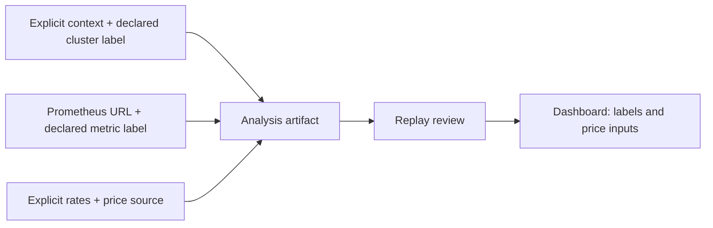

# 0095: Declared observation source and visible price inputs

- **Date:** 2026-09-19
- **Status:** locally validated; live EKS observation pending
- **Related phase:** post-MVP EKS compatibility
- **Feature commit:** `10ebe22 feat: retain observation source and guard Pod metric identity`

## Why

Schema v2 retains workload identity, aggregate observations, recommendation policy,
and price assumptions, but a reviewer could not see which cluster and metrics source
the operator intended. The dashboard showed `price_source` while hiding the numeric
unit rates. Neither omission should be filled by claiming that KubeFit authenticates
an EKS data source or verifies AWS billing.

## Success criteria

- New analyses may carry safe, explicit cluster and metrics-source labels.
- Labels require an explicit Kubernetes context, but do not expose raw context or URL.
- Old v1/v2 artifacts remain readable and retain their existing serialized fields.
- Reanalysis preserves the declaration; review labels it operator-declared.
- The dashboard shows the declaration and both supplied unit rates.

## What changed and how

`kubefit analyze` accepts `--cluster-label` and `--metrics-source-label` as a pair
only when `--context` is explicit. The labels allow letters, digits, dots,
underscores, and hyphens, but no URL punctuation or whitespace. An optional
`observation_source` object is included in new v2 analyses only when requested.
`reanalyze` carries it forward. The API review returns it with an explicit limitation:
replay does not authenticate either source. Existing `price_source` and per-unit
numbers are now displayed together in the review UI.



The diagram shows an evidence description, not external attestation. No AWS API,
EKS cluster, or billing data was used in this slice.

## Problems encountered

The source must remain optional to avoid changing existing content-addressed
artifact bytes. A raw context can contain an AWS account identifier and a Prometheus
URL may contain private endpoints or credentials, so neither is serialized. Short
labels are useful for review, but they can be declared incorrectly; the limitation
must remain visible beside them.

## Evidence

```bash
.venv/bin/pytest -q tests/test_analysis_artifact.py tests/test_cli.py tests/test_api.py
.venv/bin/pytest -q
.venv/bin/ruff check .
(cd dashboard && npm test -- --run && npm run build)
git diff --check
```

Focused Python result: 102 passed. Full Python suite: 536 passed with one
third-party Starlette deprecation warning. Dashboard: 19 tests passed and
production build succeeded. Ruff and diff checks passed.

## Decision and limitations

KubeFit can now retain and display an operator's declared observation source and
the full cost-rate assumptions without leaking its configured endpoint. It still
cannot prove that metrics came from the named EKS cluster or that the projected
request-cost delta changed an AWS invoice. No live EKS compatibility claim is made.

## Next question

Can a budgeted, short-lived EKS pilot show matching Kubernetes identity and
Prometheus metrics without weakening the existing kind-only mutation guards?
