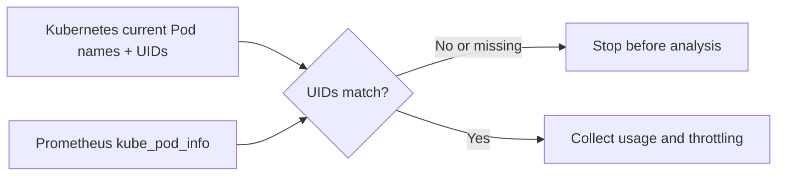

# 0096: Current-Pod UID source guard

- **Date:** 2026-09-19
- **Status:** locally validated; live EKS observation pending
- **Related phase:** post-MVP EKS compatibility
- **Feature commit:** `10ebe22 feat: retain observation source and guard Pod metric identity`

## Why

The previous slice retained operator-declared source labels, but a mislabeled or
stale Prometheus URL could still return plausible workload metrics. A one-time
current-Pod identity comparison makes that mistake fail before analysis without
requiring any cluster mutation.

## Success criteria

- An opt-in check requires an explicit Kubernetes context.
- Current Pod UIDs from Kubernetes must match Prometheus `kube_pod_info` UIDs.
- Missing, stale, duplicate/conflicting, or malformed identity series fail closed.
- The check runs before metric collection and before identity-store writes.
- Existing local workflows remain unchanged when the flag is absent.

## What changed and how

The collector now retains each current Pod UID. `--verify-pod-uid-source` performs
an instant Prometheus query for precisely those Pods and compares namespace, Pod
name, UID, and gauge value. A mismatch stops `readiness` or `analyze`. The EKS pilot
runbook enables this check on both commands.



The check compares current identity only; it does not attest the Prometheus server
or authenticate historic samples. `kube_pod_info` is documented as a stable
kube-state-metrics metric with a Pod UID label.

## Problems encountered

The existing `DeploymentResources` carried Pod names but not Pod UIDs, so the
collector was extended without changing other callers. The instant query can
temporarily fail immediately after Pod creation while kube-state-metrics catches
up; this is a safe retry condition, not permission to bypass verification.

## Evidence

```bash
.venv/bin/pytest -q tests/test_kubernetes.py tests/test_prometheus.py tests/test_cli.py
.venv/bin/pytest -q
.venv/bin/ruff check .
git diff --check
```

Focused collector and CLI result: 110 passed. Full Python suite: 543 passed with
one third-party Starlette deprecation warning. Ruff and diff checks passed. No EKS
cluster was created or queried for this slice.

## Decision and limitations

This guard can detect a current-Pod mismatch between the selected Kubernetes
context and Prometheus endpoint. It is optional and adds a `kube_pod_info` metric
requirement. Passing it is not proof that every historical CPU or memory sample
came from the same cluster, nor is it an AWS billing validation.

## Next question

Can a real, short-lived EKS pilot produce complete multi-day observations and
pass the Pod UID guard within a bounded cost and cleanup plan?
