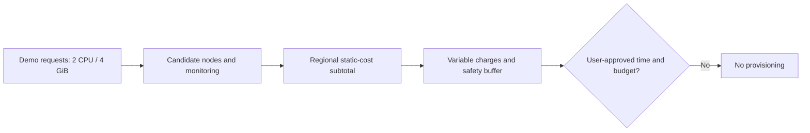

# 0098: Dated Seoul EKS pilot price probe

- **Date:** 2026-09-19
- **Status:** estimated; provisioning not approved
- **Related phase:** post-MVP EKS compatibility
- **Change type:** documentation and read-only AWS pricing queries

## Why

The EKS decision gate required a full-environment rate sheet but had no concrete
reference configuration. Without one, “short test” could hide node, NAT, storage,
and public IPv4 charges. The current AWS account has no EKS cluster in Seoul, so
there was no existing workload to reuse for live validation.

## Success criteria

- Get dated regional rates from AWS's own price list without creating resources.
- Estimate a plausible time-boxed compatibility environment from KubeFit's actual
  two-Pod demo requests.
- Mark omitted variable costs and capacity uncertainty before any approval.
- Leave infrastructure creation, billing changes, and PR claims untouched.

## What changed and how

The [validation decision gate](../eks-validation-plan.md) now contains a four-hour
candidate with one EKS control plane, two `m6i.large` workers, one NAT gateway,
one public IPv4 address, and 40 GB of provisional gp3 root storage. AWS's Price
List Query API returned Seoul rates of $0.118 per `m6i.large` hour, $0.0912 per
gp3 GB-month, $0.059 per NAT gateway hour, and $0.059 per NAT-processed GB. The
official EKS and VPC pages provide $0.10 per standard-support cluster hour and
$0.005 per public IPv4 hour.

The candidate's static subtotal is about $0.405/hour or $1.620 for four hours.
This is not a final AWS bill estimate or a spending cap.

## Problems encountered

NAT gateway products are under the AWS Price List's `AmazonEC2` service code and
`NGW:NatGateway` group rather than the obvious `AmazonVPC` query. Querying the
wrong service returned no rows; the corrected filter identified hourly and
per-GB charges. No product was selected by a zero-result query.

## Evidence

Read-only AWS calls checked the Seoul `m6i.large` offering and queried `AmazonEC2`
products for the exact Region, Linux/shared/on-demand compute, gp3 storage, and
NAT group. No EKS, EC2, VPC, EBS, or billing resource was created or changed.
The source prices and arithmetic are recorded in the decision gate. Local check:
`git diff --check`.

## Decision and limitations

There is enough information to **discuss** an EKS compatibility pilot, but not to
provision it. Node allocatable capacity, network security, EKS add-ons, image pulls,
cross-AZ traffic, variable charges, budget, and cleanup ownership remain to be
reviewed. A synthetic one-hour observation cannot prove real-user savings.

## Next question

Will the operator approve a specific maximum duration and total spending budget,
after reviewing the exact infrastructure plan and teardown checklist?
