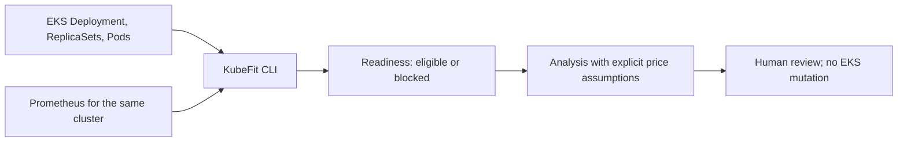

# EKS read-only pilot

This is a **collection and recommendation compatibility test**, not an EKS deployment
or a measured AWS bill-saving claim. KubeFit runs outside the cluster. The existing
`readiness` and `analyze` commands read a selected Deployment and a Prometheus endpoint;
they do not apply Kubernetes changes. No KubeFit Helm installation, AMP workspace,
Pod Identity, or new EKS cluster is required for this first slice.



The boundary matters: a local kind benchmark cannot prove EKS performance or justify
an EKS rollout. The existing benchmark, change-execution, and PodKill commands remain
restricted to explicit `kind-*` contexts. Do not bypass those guards for this pilot.

## Prerequisites

- An **existing** EKS cluster, a selected namespace/Deployment/container, and a
  representative observation window. The production profile defaults to seven days,
  five-minute steps, at least 100 samples, and at least 70% coverage. A recently
  created workload can report insufficient history.
- The target container defines CPU and memory requests **and** limits. The Kubernetes
  identity needs `get` on Deployments and `list` on ReplicaSets and Pods in the target
  namespace. Use a least-privilege, read-only identity; do not give it update, patch,
  or delete permissions for this pilot.
- A Prometheus endpoint for **that same cluster** with `kube_pod_owner` from
  kube-state-metrics and cAdvisor's CPU usage, memory working set, and CPU throttling
  period metrics. Access via a trusted endpoint or temporary local port-forward.
  Port-forward access may require `create` on `pods/portforward`; it does not grant
  KubeFit permission to change the Deployment.
- AWS CLI and `kubectl` configured by the operator. Never put credentials, kubeconfig,
  private endpoint URLs, or unredacted workload data in a public artifact or PR.

## One-workload procedure

Fill in the values for the cluster you have permission to inspect. The isolated
`.kubefit/` directory is Git-ignored. `update-kubeconfig` changes only that local file;
it does not create an EKS cluster.

```bash
mkdir -p .kubefit/eks-pilot
export KUBECONFIG="$PWD/.kubefit/eks-pilot/kubeconfig"
aws eks update-kubeconfig --region <region> --name <cluster-name> \
  --alias kubefit-eks-pilot --kubeconfig "$KUBECONFIG"
kubectl --context kubefit-eks-pilot get deployment <deployment> \
  -n <namespace> -o name
kubectl --context kubefit-eks-pilot auth can-i list replicasets -n <namespace>
kubectl --context kubefit-eks-pilot auth can-i list pods -n <namespace>
```

Confirm the Prometheus URL queries this cluster, not an old local kind instance.
For an in-cluster Prometheus Service, keep the following in a separate terminal;
replace its namespace and Service name with the actual installation. If a trusted
Prometheus URL already exists, skip the port-forward and pass that URL instead.

```bash
export KUBECONFIG="$PWD/.kubefit/eks-pilot/kubeconfig"
kubectl --context kubefit-eks-pilot -n <prometheus-namespace> port-forward \
  service/<prometheus-service> 19090:9090
```

Use `19090` deliberately: a local kind Prometheus may still be bound to `9090`.
From the first terminal, check observation eligibility before generating an analysis:

```bash
kubefit readiness \
  --context kubefit-eks-pilot \
  --namespace <namespace> \
  --deployment <deployment> \
  --container <container> \
  --prometheus-url http://127.0.0.1:19090 \
  --verify-pod-uid-source \
  --identity-store .kubefit/eks-pilot/identities.json \
  > .kubefit/eks-pilot/readiness.json
```

If readiness is `collecting` or `blocked`, inspect its reasons; do not switch to the
one-hour `demo` profile to make a production workload appear eligible. Also stop if
the Prometheus target or metric labels do not match the intended cluster/workload.
Only after checking the report, supply **documented** CPU and memory unit rates:

```bash
kubefit analyze \
  --context kubefit-eks-pilot \
  --namespace <namespace> \
  --deployment <deployment> \
  --container <container> \
  --prometheus-url http://127.0.0.1:19090 \
  --verify-pod-uid-source \
  --identity-store .kubefit/eks-pilot/identities.json \
  --cluster-label eks-seoul-pilot \
  --metrics-source-label prometheus-pilot \
  --cpu-core-hour-usd <documented-rate> \
  --memory-gib-hour-usd <documented-rate> \
  --price-source <source-and-date> \
  > .kubefit/eks-pilot/analysis.json
```

The result is a **request-cost projection from supplied rates**, not an AWS invoice
forecast. On EC2-backed EKS, lower requests may improve available capacity without
reducing any node count or the bill. Record the actual node type, allocation method,
and pricing assumptions before quoting dollars. AWS split cost allocation data can
help inspect allocated EKS costs later, but it is separate from a counterfactual
savings measurement.

The two source labels are deliberately short, non-secret names; they are stored in
the analysis and shown in the review dashboard. They must be supplied together with
an explicit `--context`. They are **operator-declared**, not an authenticated proof
that the Kubernetes and Prometheus data came from the same EKS cluster. The endpoint
URL and raw kubeconfig are not embedded in the analysis. The existing `--price-source`
and unit rates remain the only price evidence; KubeFit does not verify an AWS bill.

`--verify-pod-uid-source` adds a fail-closed, read-only check before metric collection:
each current Pod UID from the Kubernetes API must equal `kube_pod_info` in the selected
Prometheus. Missing or stale series stop the command. This reduces accidental
cross-cluster or stale-endpoint mistakes, but it checks only current Pod identity at
query time. It does not authenticate Prometheus, replay historic raw samples, or prove
that the entire observation window came from one cluster.

## Exit criteria and next boundary

The pilot succeeds when one authorized EKS Deployment yields a reviewed readiness
report and analysis with adequate workload metrics, explicit provenance, and no
cluster mutation. Record the selected context/region, namespace, Deployment UID,
container, observation window, Prometheus source, and price source **privately**
alongside the JSON. The analysis carries declared source labels, not an authenticated
cluster identity, so the JSON alone must not be treated as proof of its EKS origin.

If there is no existing EKS cluster or no representative metrics, stop here. Creating
a temporary EKS environment requires the separate
[validation decision gate](eks-validation-plan.md). True
EKS-specific before/after performance validation also needs an isolated EKS test
environment and its own safety design; it is not established by this read-only pilot.
